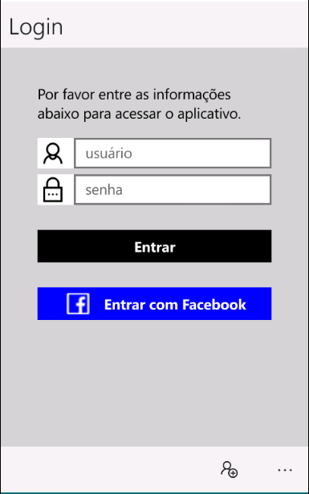

# MeetingManager
Projeto de gerenciamento de reserva de salas, para reuniões e encontros. Realizado como projeto da maratona xamarin intermediaria.

<h1>Fase 1 - Integração rede social com Azure (Facebook)</h1>
Configurado um novo serviço Mobile App no Azure, e adicionada a função de autorização via rede social, mais especificamente Facebook.
Resgatado em <a href="developers.facebook.com">Facebook Developers</a> o Api ID e o AppSecret do aplicativo. E adicionada a url de callback: 
  https://paulokinjomaratonaxamarin.azurewebsites.net/.auth/login/facebook/callback
1.1 - Adicionado Nuget Package - Microsoft.WindowsAzure.Mobile; Newtonsoft.Json;Xam.Plugins.Settings.

<h1>Fase 2 - Push notification </h1>

Configurado um novo serviço no azure de push notification "Hub", configuração para Windows(WNS) e Google(GCM)

Adicionado ao portable a classe estatica Configuration.cs - para definir a configuração de hub notification para as diferentes plataformas.

<h1>Fase 3 - Serviço de Navegação entre ViewModels</h1>
Implementado serviço de navegação da aplicação.

Agrupado serviços em um UnitOfWork. (AppServices.cs)

Registrada as viewmodels no inicio do App.cs

Obs: Implementação baseada no livro: Mastering Xamarin UI Development (https://www.packtpub.com/application-development/mastering-xamarin-ui-development)

<h1>Fase 4 - Cadastro e Gerenciamento de Salas</h1>
Adicionado um banco de dado em memória, para ser utilizado pelo repositório.

Configurado um Custom Enum Drop Down List para cadastro das salas.

Finalizado o salvamento e a edição das salas.
<h1>Fase 5 - Regra para Reserva de salas</h1>
Todo:
<h1>Fase 6 (final) - Tela de configuração. "Aceito receber notificações"</h1>
